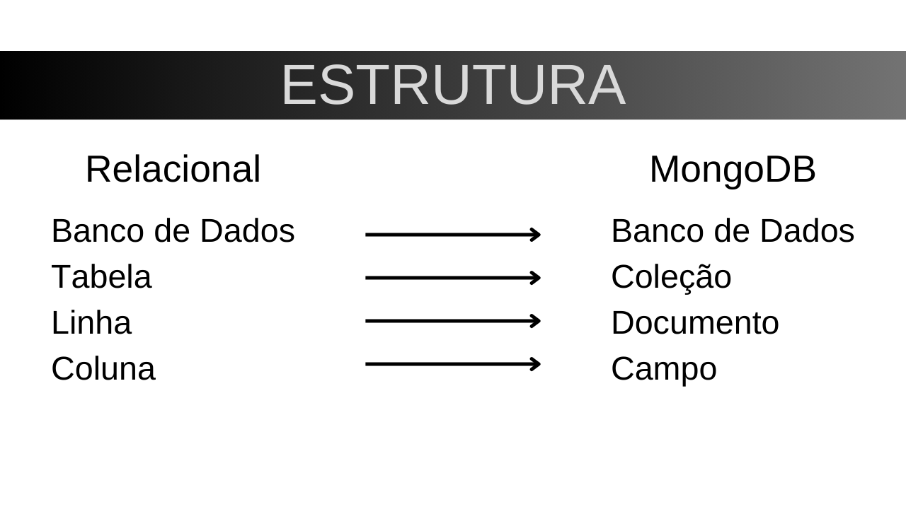

## 📌 Como o mongodb armazena os dados?

## 📌 Como os relacionamentos funcionam no MongoDB?

Diferente de um banco relacional, onde os relacionamentos são mantidos por chaves primárias e estrangeiras distribuídas entre tabelas, no MongoDB existem duas formas principais de estruturar relacionamentos:

### Documentos Incorporados (Embedded Documents)
Os dados relacionados são armazenados dentro de um mesmo documento.

**Exemplo:** No seu banco, os programadores estão dentro das startups e os dependentes dentro dos programadores.
- 🚀 **Vantagem:** Acesso rápido e eficiente aos dados relacionados sem necessidade de joins.
- ⚠️ **Desvantagem:** Pode gerar documentos muito grandes, tornando atualizações mais complexas.

### Referências entre documentos (Normalization via References)
Os relacionamentos são feitos por meio do armazenamento de IDs de documentos externos.

**Exemplo:** Em vez de armazenar os programadores dentro das startups, poderíamos ter uma coleção separada de programadores, cada um com um campo `startup_id` referenciando a startup à qual pertence.
- 🔗 **Vantagem:** Evita duplicação e facilita atualização de dados.
- 🔄 **Desvantagem:** Requer lookups para buscar informações de diferentes coleções.
