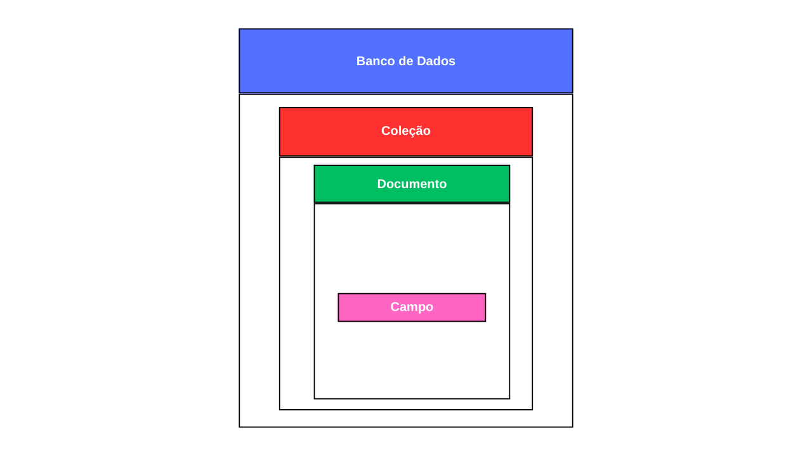

## 📌 Processo de instalação do MongoDb + MongoDB Compass

1. Acesse o site www.mongodb.com


2. Clique em "Produtos" no menu superior e depois clique em "Community Edition".


3. Role a tela e clique em "Download".


4. Clique em "Next".


5. Aceite os termos no Acordo de Licença e clique em "Next".


6. Clique em "Complete".


7. Clique em "Next".


8. Marque a opção "Install MongoDB Compass" e clique em "Next".


9. Por fim clique em "Install".


## 📌 Como o MongoDB armazena os dados?


## 📌 Representação visual.




1. **Coleção `startups`**  
   - Cada documento representa uma startup.  
   - Contém informações como nome da startup e cidade sede.  
   - Possui um array de `programadores`, onde cada programador tem suas informações pessoais, um array de linguagens de programação e um array de `dependentes`, que também tem suas informações pessoais.

2. **Coleção `programadoresDisponiveis`**  
   - Contém um array de programadores que ainda não estão vinculados a startups.  
   - Cada programador tem suas informações pessoais, um array de linguagens de programação e um array de `dependentes`, que também tem suas informações pessoais.

## 📌 Como os relacionamentos funcionam no MongoDB?

Diferente de um banco relacional, onde os relacionamentos são mantidos por chaves primárias e estrangeiras distribuídas entre tabelas, no MongoDB existem duas formas principais de estruturar relacionamentos:

### Documentos Incorporados (Embedded Documents)
Os dados relacionados são armazenados dentro de um mesmo documento.

**Exemplo:** No nosso banco, os programadores estão dentro das startups e os dependentes dentro dos programadores.
- 🚀 **Vantagem:** Acesso rápido e eficiente aos dados relacionados sem necessidade de joins.
- ⚠️ **Desvantagem:** Pode gerar documentos muito grandes, tornando atualizações mais complexas.

### Referências entre documentos (Normalization via References)
Os relacionamentos são feitos por meio do armazenamento de IDs de documentos externos.

**Exemplo:** Em vez de armazenar os programadores dentro das startups, poderíamos ter uma coleção separada de programadores, cada um com um campo `startup_id` referenciando a startup à qual pertence.
- 🔗 **Vantagem:** Evita duplicação e facilita atualização de dados.
- 🔄 **Desvantagem:** Requer lookups para buscar informações de diferentes coleções.

## 📌 CRUD

<details>
  <summary>Comandos</summary>

### Exibe uma lista de todos os bancos de dados no servidor MongoDB.

````
show dbs
````

### Seleciona o banco de dados especificado para que você possa trabalhar nele.

````
use nome-do-database-desejado
```` 

  </details>

<details>
  <summary>(Create) armazenamento/carga</summary>

### Documento startups

````
/** 
* Paste one or more documents here
*/
{
  "_id": {
    "$oid": "67b45cc4d23e5ee117e0dd67"
  },
  "nomeStartup": "Tech4Toy",
  "cidadeSede": "Porto Alegre",
  "programadores": [
    {
      "nomeProgramador": "João Pedro",
      "generoProgramador": "M",
      "dataNascimentoProgramador": "1993-06-23",
      "nomeLinguagens": [ "Python", "PHP" ],
      "dependentes": [
        {
          "nomeDependente": "André Sousa",
          "parentescoDependente": "Filho",
          "dataNascimentoDependente": "2020-05-15"
        }
      ]
    },
    {
      "nomeProgramador": "Ana Cristina",
      "generoProgramador": "F",
      "dataNascimentoProgramador": "1968-02-19",
      "nomeLinguagens": [],
      "dependentes": []
    }
  ],
  "nomeStartup": "Smart123",
  "cidadeSede": "Belo Horizonte",
  "programadores": [
    {
      "nomeProgramador": "Paula Silva",
      "generoProgramador": "F",
      "dataNascimentoProgramador": "1986-01-10",
      "nomeLinguagens": [ "Java" ],
      "dependentes": [
        {
          "nomeDependente": "Luciana Silva",
          "parentescoDependente": "Filha",
          "dataNascimentoDependente": "2018-07-26"
        },
        {
          "nomeDependente": "Elisa Silva",
          "parentescoDependente": "Filha",
          "dataNascimentoDependente": "2020-01-06"
        },
        {
          "nomeDependente": "Breno Silva",
          "parentescoDependente": "Esposo",
          "dataNascimentoDependente": "1984-05-21"
        }
      ]
    },
    {
      "nomeProgramador": "Laura Marques",
      "generoProgramador": "F",
      "dataNascimentoProgramador": "1987-10-04",
      "nomeLinguagens": [ "Python", "PHP" ],
      "dependentes": [
        {
          "nomeDependente": "Daniel Marques",
          "parentescoDependente": "Filho",
          "dataNascimentoDependente": "2014-06-06"
        }
      ]
    }
  ],
  "nomeStartup": "knowledgeUp",
    "cidadeSede": "Rio de Janeiro",
    "programadores": [
        {
            "nomeProgramador": "Renata Vieira",
            "generoProgramador": "F",
            "dataNascimentoProgramador": "1991-07-05",
            "nomeLinguagens": [ "C", "JavaScript" ],
            "dependentes": []
        }
    ],
    "nomeStartup": "BSI Next Level",
    "cidadeSede": "Recife",
    "programadores": [
        {
            "nomeProgramador": "Felipe Santos",
            "generoProgramador": "M",
            "dataNascimentoProgramador": "1976-11-25",
            "nomeLinguagens": [ "JavaScript" ],
            "dependentes": [
                {
                    "nomeDependente": "Rafaela Santos",
                    "parentescoDependente": "Esposa",
                    "dataNascimentoDependente": "1980-02-12"
                },
              {
                    "nomeDependente": "Marcos Martins",
                    "parentescoDependente": "Filho",
                    "dataNascimentoDependente": "2008-03-26"
                }
            ]
        },
        {
            "nomeProgramador": "Fernando Alves",
            "generoProgramador": "M",
            "dataNascimentoProgramador": "1988-07-07",
            "nomeLinguagens": [],
            "dependentes": [
                {
                    "nomeDependente": "Laís Meneses",
                    "parentescoDependente": "Esposa",
                    "dataNascimentoDependente": "1990-11-09"
                }
            ]
        }
    ],
  "nomeStartup": "QualiHealth",
    "cidadeSede": "São Paulo",
    "programadores": [
      {
      "nomeProgramador": "",
      "generoProgramador": "",
      "dataNascimentoProgramador": "",
      "nomeLinguagens": [],
      "dependentes": [
        {
          "nomeDependente": "",
          "parentescoDependente": "",
          "dataNascimentoDependente": ""
        }
      ]
    }
    ],
  "nomeStartup": "ProEdu",
    "cidadeSede": "Florianópolis",
    "programadores": [
      {
      "nomeProgramador": "",
      "generoProgramador": "",
      "dataNascimentoProgramador": "",
      "nomeLinguagens": [],
      "dependentes": [
        {
          "nomeDependente": "",
          "parentescoDependente": "",
          "dataNascimentoDependente": ""
        }
      ]
    }
    ],
  "nomeStartup": "CommerceIA",
  "cidadeSede": "Manaus",
  "programadores": [
    {
      "nomeProgramador": "Alice Lins",
      "generoProgramador": "F",
      "dataNascimentoProgramador": "2000-10-09",
      "nomeLinguagens": [],
      "dependentes": [
        {
          "nomeDependente": "",
          "parentescoDependente": "",
          "dataNascimentoDependente": ""
        }
      ]
    }
  ]
}
````
  
### Documento programadoresDisponiveis
  
````
/** 
* Paste one or more documents here
*/
{
  "_id": {
    "$oid": "67b46da3d23e5ee117e0dd6b"
  },
  "programadoresDisponiveis": [
    {
      "nomeProgramador": "Lucas Lima",
      "generoProgramador": "M",
      "dataNascimentoProgramador": "2000-10-09",
      "nomeLinguagens": [],
      "dependentes": [
        {
          "nomeDependente": "",
          "parentescoDependente": "",
          "dataNascimentoDependente": ""
        }
      ]
    },
    {
      "nomeProgramador": "Camila Macedo",
      "generoProgramador": "F",
      "dataNascimentoProgramador": "1995-07-03",
      "nomeLinguagens": [ "C", "SQL" ],
      "dependentes": [
        {
          "nomeDependente": "Lidiane Macedo",
          "parentescoDependente": "Filha",
          "dataNascimentoDependente": "2015-04-14"
        }
      ]
    },
    {
      "nomeProgramador": "Leonardo Ramos",
      "generoProgramador": "M",
      "dataNascimentoProgramador": "2005-07-05",
      "nomeLinguagens": [ "SQL" ],
      "dependentes": [
        {
          "nomeDependente": "",
          "parentescoDependente": "",
          "dataNascimentoDependente": ""
        }
      ]
    }
  ]
}
````

### Inserção da startup InovaTech.
  
````
db.startups.insertOne({
  "nomeStartup": "InovaTech",
  "cidadeSede": "Curitiba",
  "programadores": [
    {
      "nomeProgramador": "Carlos Mendes",
      "generoProgramador": "M",
      "dataNascimentoProgramador": "1990-05-12",
      "nomeLinguagens": ["Python", "C#"],
      "dependentes": [
        {
          "nomeDependente": "Maria Mendes",
          "parentescoDependente": "Filha",
          "dataNascimentoDependente": "2017-08-22"
        }
      ]
    }
  ]
})
```` 

  </details>

<details>
  <summary>(Read) leitura</summary>

### Retorna as startups.
  
````
db["startups"].find()
````


### Retorna as startups que têm programadores que sabem programar em Java.
  
````
db.startups.find({"programadores.nomeLinguagens": "Java"})
````

  </details>

<details>
  <summary>(Update) atualização</summary>

### Atualiza a cidade sede para São Paulo.
  
````
db.startups.updateOne(
  { "nomeStartup": "InovaTech" },
  { $set: { "cidadeSede": "São Paulo" } }
)

````

  </details>

<details>
  <summary>(Delete) remoção</summary>
  
### Remove a startup InovaTech.
  
````
db.startups.deleteOne({ "nomeStartup": "InovaTech" })
````

  </details>

<details>
  <summary>Consulta conceito relacional</summary>
  
### Buscar todos os programadores que nasceram a partir do ano 2000.
  
````
db.startups.aggregate([
  { $unwind: "$programadores" }, 
  { 
    $match: { 
      "programadores.dataNascimentoProgramador": { $gte: "2000-01-01" } 
    } 
  },
  { 
    $project: { 
      _id: 0, 
      "programadores.nomeProgramador": 1, 
      "programadores.dataNascimentoProgramador": 1, 
      "nomeStartup": 1 
    } 
  }
])
````

### Explicação:
- **$unwind**: Separa os programadores dentro das startups para tratar cada um como um documento individual.
- **$match**: Filtra apenas os programadores com `dataNascimentoProgramador >= "2000-01-01"`.
- **$project**: Retorna apenas os campos `nomeProgramador`, `dataNascimentoProgramador` e `nomeStartup`, ocultando o `_id`.

### Comparação com SQL.
Se o banco fosse relacional, um equivalente em SQL seria algo assim:

````
SELECT p.nomeProgramador, p.dataNascimentoProgramador, s.nomeStartup
FROM programadores p
JOIN startups s ON p.startup_id = s.id
WHERE p.dataNascimentoProgramador >= '2000-01-01';
````


  </details>
